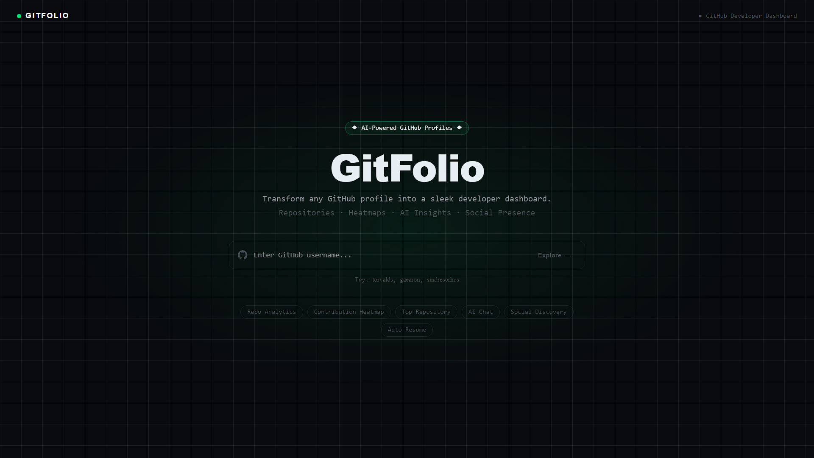

<div align="center">




### Transform any GitHub profile into a sleek developer dashboard

[](https://nextjs.org/)
[](https://www.typescriptlang.org/)
[](https://tailwindcss.com/)
[](https://docs.github.com/en/rest)
[](LICENSE)

<br/>

**GitFolio** is a developer intelligence platform that turns any GitHub username into a rich, interactive profile dashboard — complete with repo analytics, contribution heatmaps, language breakdowns, and an AI assistant that knows everything about the developer.

<br/>

</div>

---

## ✨ Features

| Feature | Description |
|---|---|
| 🔍 **Profile Search** | Search any GitHub user by username with instant validation |
| 📊 **Profile Analytics** | Followers, following, repo count, join year, bio, social links |
| 🏆 **Top Repository** | Highlights the developer's most starred repository with topics and stats |
| 🗂️ **Repository Explorer** | Browse all repos with search, sort (stars / forks / updated), and language filter |
| 🟩 **Contribution Heatmap** | GitHub-style activity grid for the past year with streaks and best day stats |
| 🎨 **Language Bar** | Visual breakdown of languages used across all public repositories |
| 🤖 **AI Developer Chat** | Ask anything about the developer — stack, best role fit, social handles, hiring insights |
| 🔗 **Social Discovery** | AI surfaces Twitter/X, personal site, and other handles as clickable links |
| 💼 **Hiring Mode** | Use AI to evaluate a developer's strengths, role fit, and contribution consistency |
| 📱 **Fully Responsive** | Mobile-first layout with a collapsible AI chat panel |

---

## 🖥️ Demo

Try these profiles to see GitFolio in action:

```
torvalds    →  Creator of Linux & Git
gaearon     →  Creator of React
sindresorhus →  Open-source prolific contributor
```

---

## 🚀 Getting Started

### Prerequisites

- Node.js `18+`
- npm / yarn / pnpm
- An Anthropic API key (for AI Chat)

### Installation

```bash
# Clone the repository
git clone https://github.com/ShakibCodes/gitfolio.git
cd gitfolio

# Install dependencies
npm install
```


### Run Locally

```bash
npm run dev
```

Open [http://localhost:3000](http://localhost:3000) in your browser.

---

## 🗂️ Project Structure

```
gitfolio/
├── app/
│   ├── api/
│   │   └── chat/
│   │       └── route.ts          # AI Chat API route (Anthropic)
│   ├── dashboard/
│   │   └── [username]/
│   │       └── page.tsx          # Dynamic dashboard page
│   ├── globals.css               # Design tokens, animations, utilities
│   ├── layout.tsx                # Root layout with font imports
│   └── page.tsx                  # Home / Search page
│
├── components/
│   ├── Aichat.tsx                # AI chat panel with streaming
│   ├── Heatmap.tsx               # Contribution activity heatmap
│   ├── LanguageBar.tsx           # Language usage breakdown bar
│   ├── ProfileCard.tsx           # User profile stats card
│   ├── RepoCard.tsx              # Individual repository card
│   ├── Searchpage.tsx            # Landing / search UI
│   └── TopRepo.tsx               # Highlighted top repository card
│

```

---

## 🤖 AI Chat Capabilities

The AI assistant is loaded with full context about the developer, including their repos, bio, languages, follower count, and more. You can ask it things like:

```
"What is this developer best at?"
"What role would they fit — frontend, backend, or fullstack?"
"Do they have a Twitter or personal website?"
"Would you recommend hiring them for a Python project?"
"What's their most impressive repository?"
"How active are they on GitHub?"
```

The AI returns social handles as **clickable links** and gives detailed, context-aware answers powered by Claude (Anthropic).

---

## 🛠️ Tech Stack

- **Framework** — [Next.js 15](https://nextjs.org/) with App Router
- **Language** — [TypeScript](https://www.typescriptlang.org/)
- **Styling** — [Tailwind CSS v4](https://tailwindcss.com/) with custom `@theme` tokens
- **AI** — [Anthropic Claude](https://www.anthropic.com/) via `/api/chat` route
- **Data** — [GitHub REST API](https://docs.github.com/en/rest) (public, no auth required)
- **Routing** — Dynamic routes via `app/dashboard/[username]/page.tsx`

---

## 🤝 Contributing

Contributions are welcome! Here's how to get started:

```bash
# Fork the repo, then:
git checkout -b feat/your-feature-name
git commit -m "feat: add your feature"
git push origin feat/your-feature-name
# Open a Pull Request
```

**Ideas for contributions:**
- GitHub API auth to increase rate limits
- Export profile as PDF / Resume
- Pinned repositories support
- Org profile support
- Dark/light theme toggle

---

## 📄 License

MIT © [Your Name](https://github.com/ShakibCodes)

---

<div align="center">

**[⭐ Star this repo](https://github.com/ShakibCodes/gitfolio)** if you find it useful!

</div>